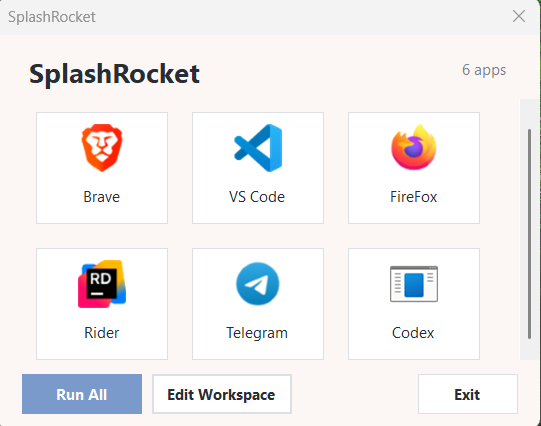

# SplashRocket



A lightweight Windows desktop launcher for organizing and running your favorite apps from one place.

## Features

- Add any executable or file to a visual tile grid
- Launch a single app with a click, or run all apps at once
- Reorder, edit, and remove apps from the workspace
- Custom icon support
- Workspace is saved automatically and persists across restarts

## Download

Grab the latest portable build from `SplashRocket-win-x64.zip` in the repository. Extract it anywhere and run `SplashRocket.exe`.

> Windows may show a SmartScreen warning because the app is not code-signed. Click **More info → Run anyway**.

## Requirements

- Windows 10/11 x64
- No .NET runtime installation needed — the portable build is self-contained

## How to use

1. Run `SplashRocket.exe`
2. Click **Edit Workspace**
3. Add apps with the **+ Add** button
4. Save and launch apps from the main window

Your workspace is saved to `%LocalAppData%\SplashRocket\workspace.json`.

## Build from source

Requires the .NET 10 SDK or later.

```bash
dotnet build
```

Publish a self-contained portable build:

```bash
dotnet publish -c Release -r win-x64 --self-contained true
```

The output will be in `SplashRocket/bin/Release/net10.0-windows/win-x64/publish/`.

## Project structure

```
SplashRocket/
  Controls/      Custom UI controls (AppTile)
  Forms/         Main window and editor dialogs
  Helpers/       Icon extraction and scaling
  Models/        App and workspace data classes
  Services/      Workspace persistence and app launching
  UI/            Theme, colors, and button styles
```

## License

MIT
